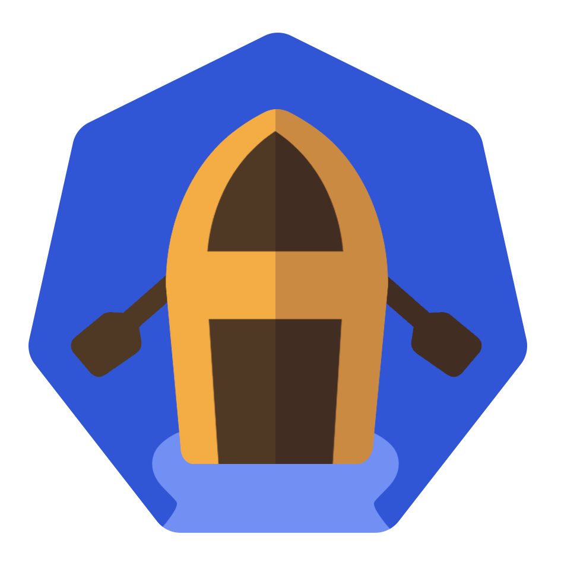

# Anago

Anago, in Ancient Greek, means to lead to a higher place, to uplift, and to take to sea. In this spirit, Team Anago hopes to serve as a perfect compass to help you manage your containerized application deployments on the Kubernetes platform.

Anago is a tool to help developers monitor and visualize their Kubernetes clusters. Team Anago is equipped for monitoring Kubernetes clusters hosted both on local servers and on cloud-based platforms. Anago provides out-of-the-box support for Prometheus and Prometheus’ Alertmanager for scraping metrics and alerts, and integrates with Chart.JS for the dashboard graphs. Let’s dive into how the features of Anago’s platform can simplify and streamline managing your Kubernetes clusters.

## Table of Contents

1. [Anago](#Anago)
2. [Features](#features)
3. [Installations & Getting Started](#installations-&-getting-started)
4. [File Structure](#file-structure)
5. [Our Team](#our-team)
6. [License](#license)
7. [Other](#other)
8. [Issue Submission](#issue-submission)

## Features

Anago is a Kubernetes cluster monitoring and visualization tool providing relevant, richly detailed insights into the health of your application deployments with the following useful features:

1. **Real-time Data Monitoring**: Anago seamlessly integrates with your cloud-based and/or locally hosted Kubernetes clusters to allow for a real-time analysis of cluster performance.
2. **Customizable Metrics**: Anago harnesses the power of Prometheus to scrape time-series data from your Kubernetes clusters. We offer customized query-building to configure your dashboard to display cluster metrics and data insights relevant to you. We provide the tools for your cluster management, and you decide which direction you want to take them.
3. **Alerts**: Anago displays relevant real-time alerts relating to cluster health concerns, allowing you to address issues with your deployments proactively to combat downtime in production.
4. **Horizontal Autoscaling Tests**:
5. **Cluster Visualization**:
6. **Platform-agnostic**:

## Installations & Getting Started

Let’s walk through how to get your cluster <a>setup</a> with Anago

## File Structure

## Our Team

<table style="width:75%;">
<tr>
</tr>
<tr>
<td></td>
<td>Alexandra Ashcraft</td>
<td> </td>
</tr>
<tr>
<td></td>
<td>Halia Haynes</td>
<td>
</td>
</tr>
<tr>
<td></td>
<td>Rylie Pereira</td>
<td> </td>
</tr>
<tr>
<td></td>
<td>Steve Schlepphorst</td>
<td> </td>
</tr>
</table>

## License

## Other

## Issue Submission

