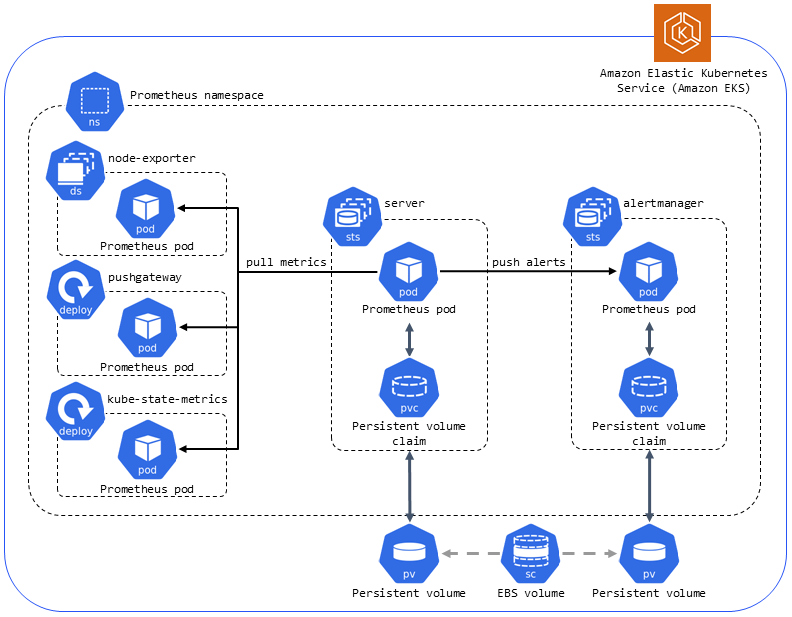

Guide to Using Prometheus

Prometheus is a powerful open-source systems monitoring and alerting toolkit that was originally built at Soundcloud in 2012.  It is useful for collecting and storing metrics as time series data (i.e., metrics are stored with the timestamp at which it was recorded, alongside optional key-value pairs called labels).  This data is useful for understanding why your application is working a certain way.

Prometheus's main features include:
-a multi-dimension data model with time-series data identified by metric name and key/value pairs
-PromQL, a flexible query language to leverage this dimensionality
-autonomous single server nodes (no reliance on distributed storage)
-time series collection happens via a pull model over HTTP
-pushing time series is supported via an intermediary gateway
-targets are discovered via service discovery or static configuration
-multiple modes of graphing and dashboarding support

Prometheus components:
-the main Prometheus server that scrapes and stores time-series data
-client libraries for instrumenting application code
-a push gateway for supporting short-lived jobs
-special-purpose exporters for services like HAProxy, StatsD, Graphite, etc.
-an alertmanager to handle alerts
-various support tools

What is the pull model?
Prometheus uses a pull model to collect metrics.  This means it scrapes HTTP endpoints where metrics are exposed either natively by the component being monitored, or through the use of a community-built Prometheus exporter. In Kubernetes, the service exposes the endpoints for us, making Prometheus and Kubernetes easy to integrate.
The metrics are exposed via HTTP using either a simple text-based format (more commonly used and widely supported) or a more efficient and robust protocol buffer format. One big advantage of the text format is that it is human-readable, which means you can open it in your browser or use a tool like curl to retrieve the current set of exposed metrics. Examples of this are seen below under the 'Prometheus Metric Types and Query Examples' heading.

Configuring Rules
Prometheus supports two types of rules which may be configured and then evaluated at regular intervals: recording rules and alerting rules. To include rules in Prometheus, create a file containing the necessary rule statements and have Prometheus load the file via the rule_files field in the Prometheus configuration. Rule files use YAML.

Recording rules allow you to precompute frequently needed or computationally expensive expressions and save their result as a new set of time series. Querying the precomputed result will then often be much faster than executing the original expression every time it is needed. This is especially useful for dashboards, which need to query the same expression repeatedly every time they refresh.

Recording and alerting rules exist in a rule group. Rules within a group are run sequentially at a regular interval, with the same evaluation time. The names of recording rules must be valid metric names. The names of alerting rules must be valid label values.

Recording rules 

Alerting rules allow you to define alert conditions based on Prometheus expression language expressions and to send notifications about firing alerts to an external service. Whenever the alert expression results in one or more vector elements at a given point in time, the alert counts as active for these elements' label sets.

PromQL, Prometheus Querying Language
Within Prometheus, you can query metrics using PromQL.  It is a domain-specific-language (DSL) built upon Go, and also a nested functional language (NFL) where data appears as nested expressions within larger expressions.  The outermost expression defined the final value, while nested expressions represent values for arguments and operands. These nested expressions, or subqueries, produce a value that serves as a variable for the larger expressions.  PromQL also allows for grouping and sorting metrics by type or label.

PromQL data types: (MORE ON THIS?)
-Floats/Scalars: Literals that can be integers or strings, and can be used with regex. For example, you can return all values in the 200s or 400s by writing code=~"2.*\4.*"
-Range vectors: select from a range within the instant that instant vectors select.
-Instant vectors: queries simply by identifying the metric name. They can be filtered by referring to their labels within curly brackets.  

Querying is made more sophisticated by PromQL's feature flags, functions, and operators. 
The query will return either a graph on the Prometheus URI, or metadata that can be exported using the HTTP API.  The HTTP API is reachable under /api/v1 on a Prometheus server.  
The API reponse format is JSON, as seen below.  The successfully collected data is returned in the data field. 

    {
    "status": "success" | "error",
    "data": <data>,

    // Only set if status is "error". The data field may still hold additional data.
    "errorType": "<string>",
    "error": "<string>",

    // Only if there were warnings while executing the request.
    // There will still be data in the data field.
    "warnings": ["<string>"]
    }

The Prometheus documentation does a stellar job of reviewing the different types of HTTP requests to various endpoints of the Prometheus API, including required parameters and providing examples. Click here for more guidance:
 https://prometheus.io/docs/prometheus/latest/querying/api/#:~:text=foo%20%2F%20bar%22%20%7D-,Querying%20metadata,via%20the%20deletion%20API%20endpoint.

Prometheus Metric Types and Query Examples
A metric data point is comprised of a metric name, a timestamp provided by the Prometheus server when the data point was collected, and a measurement represented by a numerical value.  Dimensional metrics can also include a set of labels (the 'dimensions') for additional context that allows engineers to easily aggregate and analyze a metric across multiple components and dimensions by querying for a specific metric name and filtering and grouping by label.

1. Counter: 
A cumulative metric that represents a single monotonically increasing (in other words, non-decreasing) counter whose value can only increase or be reset to zero on restart. For example, you can use a counter to represent the number of requests served, tasks completed, or errors.  Other examples include the number of orders in an e-commerce site, the number of bytes sent and received over a network interface. On its own, this is not very useful, but is often used to compute the delta between two timestamps or the rate of change over time. 

    Example of a counter metric as exposed to Prometheus:
    # HELP http_requests_total Total number of http api requests
    # TYPE http_requests_total counter
    http_requests_total{api="add_product"} 4633433

    Above, # HELP provides a description for the metric, and # TYPE denotes the metric as a counter. The metric name is 'http_requests_total', it has one label named 'api' with a value of 'add_product' and the counter's value is 4633433.  This means that the add_product API has been called 4,633,433 times since the last service start or counter reset. By convention, counter metrics are usually suffixed with _total. 

    Query examples for a counter metric:
    rate(http_requests_total{api="add_product"}[5m])
        PromQL's rate() function applied to the metric allows us to understand the requests per second that the API is receiving on average over the last five minutes.
    increase(http_requests_total{api="add_product"}[5m])
        PromQL's increase() function is a delta function that allows us to calculate the absolute change over a time period. This query returns the total number of requests made in the last five minutes.  It evaluates to the same number as multiplying the per-second rate by the number of seconds in the interval as seen below.
    rate(http_requests_total{api="add_product"}[5m]) * 5 * 60

2. Gauge: 
A metric that represents a single numerical value that can arbitrarily increase and decrease. Gauges are typically used for measured values like temperatures or current memory usage, but also "counts" that can go up and down, like the number of concurrent requests.  This metric type does not require additional processing to provide meaning.

    Example of a gauge metric as exposed to Prometheus:
    # HELP node_memory_used_bytes Total memory used in the node in bytes
    # TYPE node_memory_used_bytes gauge
    node_memory_used_bytes{hostname="host1.domain.com"} 943348382

    This metric indicates that the memory used in the node 'host1.domain.com' at the time of measurement is around 900 megabytes.  Rate() and increase() don't make much sense here, but you can use PromQL functions avg_over_time(), max_over_time(), min_over_time(), and quantile_over_time() to manipulate the data.

3. Histogram: 
In general terms, a histogram is an approximate representation of the distribution of numerical data at a single point in time.  The data is typically grouped into user-determined 'buckets', or ranges of data, that are chosen to give meaning to the data and assist in providing analysis.  

In Prometheus, a histogram samples observations (i.e. request durations, response sizes), and counts them in user-configurable buckets.  It tracks the number of observations and the sum of all observed values, which allows for the calculation of averages.  Prometheus histograms have some important differences when compared to the general definition:
-- The buckets are cumulative. Each bucket is bigger than the one before and contains the count (sum) of all observations less than or equal to its upper threshold for a given timestamp.  The user configures the number of buckets and the maximum size of each bucket ahead of time in the client.  There is no minimum size to the bucket.

Each bucket is stored internally in the Prometheus server in a separate metric suffixed '_bucket' and the maximum value ('le', representing 'less than or equal to') (for example, _bucket{le='100'}).  There is always a largest bucket with infinite maximum value {le = "Inf"} which always has the same value as '_count'. 

--  The histogram is a time-series.  Prometheus scrapes metrics from a target at specified intervals of time, each time receiving and storing a cumulative histogram that represents the distribution of observed values as recorded since the previous scrape.  It is crucial to understand that when QUERYING a histogram, the histogram displays values that each represent one of these stored cumulative histograms.  The histogram-of-histograms that the client receives is calculated within the Prometheus server at the query time.  

--  The time-series itself is cumulative.  The buckets in the Prometheus histogram are always increasing, so that the most recent instance of the histogram shows the total values for each of the buckets since the metric was first recorded.

A histogram with a base metric name of <basename> exposes multiple time series during a scrape:

-cumulative counters for the observation buckets, exposed as <basename>_bucket{le="<upper inclusive bound>"}
-the total sum of all observed values, exposed as <basename>_sum
-the count of events that have been observed, exposed as <basename>_count (identical to <basename>_bucket{le="+Inf"} above) (inherently a counter type as described in #1).

Histograms can be aggregated, which means that we can create meaningful connections between data scraped from many endpoints. 
Problems with Prometheus histograms include:
-Pre-configuration of buckets: If your buckets are not well-defined, you might not be able to compute and analyze the data that you need. For example, if you set your upper bound ('le') smaller than the size of the data, your buckets are useless.  If your 'le' is too big, then you will have challenges accurately measuring what you want to measure.
-Percentiles are approximate, not accurate.  This is another reason why bucket configuration is important, as the accuracy of your data is based mostly on the sizes of the buckets you choose in the client.  A greater number of smaller buckets allows for the greatest accuracy, but more data is then required to store and compute values. 
-Server-side percentile computing can be expensive with a lot of data.  Mitigate this by using recording rules to precompute required percentiles.

4. Summary:
Similar to a histogram, a summary samples observations. While it also provides a total count of observations and a sum of all observed values, it calculates configurable quantiles over a specified sliding time window. The number of quantiles chosen by the user results in the number of time series received when queried.

A summary with a base metric name of <basename> exposes multiple time series during a scrape:
-streaming φ-quantiles (0 ≤ φ ≤ 1) of observed events, exposed as <basename>{quantile="<φ>"}
-the total sum of all observed values, exposed as <basename>_sum
-the count of events that have been observed, exposed as <basename>_count

Summaries provide more accurate quantiles than histograms, but there are drawbacks here as well:
-Expensive quantile computing on client side. The client library must keep a sorted list of data points overtime to make this calculation.  The number of datapoints that are kept and sorted is limited, which reduces accuracy in exchange for efficiency.
-Quantiles must be predefined by the client.  There is no way to calculate other quantiles at quiery time. Adding a new quantile requires modifying the code and the metric will be available from that time forward. 
-It is impossible to aggregate summaries across multiple series, making them useless for most dynamic modern systems when you are interested in the metrics across all instances of a component.

Histograms vs. Summaries, a little more detail:
You can use both summaries and histograms to calculate estimated so-called φ-quantiles, where 0 ≤ φ ≤ 1. The φ-quantile is the observation value that ranks at number φ*N among the N observations (in English, the 0.5-quantile is known as the median. The 0.95-quantile is the 95th percentile).

The essential difference between summaries and histograms is in how and where the quantiles are calculated.  
Summaries calculate streaming φ-quantiles on the client side and expose them directly.  This makes observations expensive to calculate and reduce client performance, but infer a low server-side cost. 
Histogram expose bucketed observation counts, and quantiles are calculated server-side (as mentioned above) from the buckets using the histogram_quantile() function. 

Let's provide an example query for a Prometheus histogram: 
Consider the base metric name 'http_request_duration_seconds'.  You need to specify which exposed time-series you want to query:
'http_request_duration_seconds_sum' : The total sum of observations recorded for the metric.
'http_request_duration_seconds_count' : The total number of observations recorded for the metric.
'http_request_duration_seconds_bucket' : The total count of observations for a bucket in the histogram. 

The value that is provided when the metric is queried is the instant vector, meaning, the latest set of values scraped by Prometheus (as opposed to a range of values over time).  In other words, the instant vector is the cumulative histogram instance that shows the total values for each of the previous buckets. With every scrape, Prometheus collects an instant vector.  After the metric name 'http_request_duration_seconds_bucket', the labels within {} add dimensionality to the data and provide for the ability to filter values based on label criteria.  Note the 'le' label that signifies the cumulative count of all the observed values less than or equal to the number assigned to 'le'. (UPDATE THIS WITH BETTER VISUALS ONCE WE HAVE CONFIGURED BUCKETS!)

This cumulative count of http request durations doesn't tell us much.  Let's try to query the frequency of observations using the _count time-series and the rate() function.  rate(http_request_duration_seconds_count[1m]) will gives us the per-second rate of observations over the past minute. 

Now, let's come up with something more interesting and useful. Usually, http requests are happening at a high frequency and large volume.  Prometheus can provide us insights to how the duration of the http requests change over time and in between scraping intervals through the histogram_quantile() function.  Let's examine each query sequentially:
http_request_duration_seconds: the cumulative count of observations in each of our buckets.
http_request_duration_seconds_bucket[1m]: the cumulative counts for each bucket, but over the last minute’s scrape intervals
rate(http_request_duration_seconds_bucket[1m]): how frequently observations have been made in each of the buckets over the last minute
histogram_quantile(0.9, rate(http_request_duration_seconds_bucket[1m])): the calculated 90th percentile of request durations over the last minute (Note, this expression will require modification if working with native histograms or if aggregating.)

The histogram_quantile function above allows Prometheus to calculate which bucket label contains the given quantile (90th percentile), which means we can now find out the approximate value at which a given quantile was represented in the data.  

Quick Start with AWS EKS:
(These steps assume you have an existing VPC)

A Kubernetes namespace for Prometheus.
Node-exporter DaemonSet with a pod to monitor Amazon EKS nodes.
Pushgateway deployment with a pod to push metrics from short-lived jobs to intermediary jobs that Prometheus can scrape.
Kube-state-metrics DaemonSet with a pod to monitor the Kubernetes API server.
Server StatefulSet with a pod and attached persistent volume (PV) to scrape and store time-series data. The pod uses persistent volume claims (PVCs) to request PV resources.
Alertmanager StatefulSet with a pod and attached PV for deduplication, grouping, and routing of alerts.
Amazon Elastic Block Storage (Amazon EBS) General Purpose SSD (gp2) storage volume.

References:
https://andykuszyk.github.io/2020-07-24-prometheus-histograms.html
https://www.timescale.com/blog/four-types-prometheus-metrics-to-collect/#:~:text=The%20histogram%20buckets%20are%20exposed,than%20or%20equal%20to%20N.
https://bryce.fisher-fleig.org/prometheus-histograms/
https://promlabs.com/blog/2020/12/17/promql-queries-for-exploring-your-metrics/
https://logz.io/blog/promql-examples-introduction/#func
